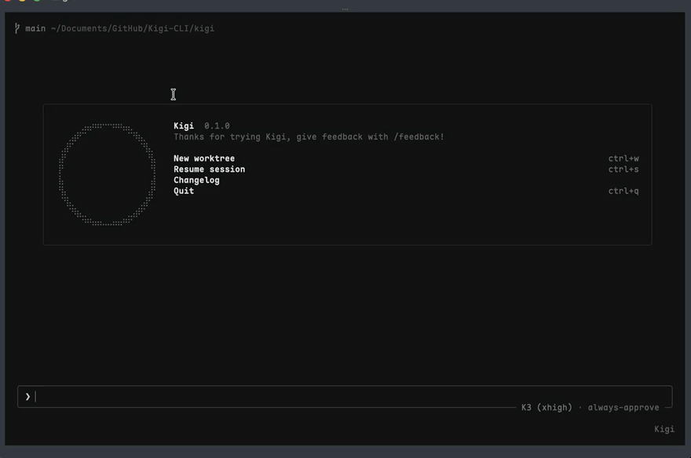

<div align="center">

<h1>Kigi (<code>kigi</code>) 🌘</h1>

**Kigi** is an unofficial Kimi Code CLI community build — a terminal-based
AI coding agent re-targeted at the Kimi Code subscription API and the
Moonshot open platform, built on the Apache-2.0 sources of
[xai-org/grok-build](https://github.com/xai-org/grok-build).

It runs as a full-screen TUI that understands your codebase, edits files,
executes shell commands, searches the web, and manages long-running tasks —
interactively, headlessly for scripting/CI, or embedded in editors via the
Agent Client Protocol (ACP).

[Installation](#installation) ·
[Providers and API keys](#providers-and-api-keys) ·
[Building from source](#building-from-source) ·
[Coexistence with the official CLI](#coexistence-with-the-official-kimi-cli) ·
[License](#license)



[Full-quality recording (mp4)](video/Kigi.mp4)

</div>

---

## Installation

Prebuilt single-file binaries for macOS (arm64/x86_64), Linux (arm64/x86_64),
and Windows (x86_64) are published on
[GitHub Releases](https://github.com/ZacharyZhang-NY/Kigi-CLI/releases):

```sh
# macOS / Linux
curl -fsSL https://raw.githubusercontent.com/ZacharyZhang-NY/Kigi-CLI/main/install.sh | bash
```

```powershell
# Windows PowerShell
irm https://raw.githubusercontent.com/ZacharyZhang-NY/Kigi-CLI/main/install.ps1 | iex
```

```sh
kigi --version   # kigi 0.1.1 … unofficial Kimi Code CLI community build
kigi login       # sign in with your Kimi Code subscription (device-code flow)
kigi             # start the TUI
```

The installer verifies every download against the release's `SHA256SUMS`,
installs into `~/.kigi/bin/kigi` (`%USERPROFILE%\.kigi\bin\kigi.exe` on
Windows), and prints the PATH line to add. Later releases arrive through the
built-in self-updater (`kigi update`, gated by `KIGI_AUTO_UPDATE`), which
pulls from the same GitHub Releases feed.

## Providers and API keys

Kigi talks to a fixed three-platform registry:

| Platform id   | Base URL                         | Auth                        |
| ------------- | -------------------------------- | --------------------------- |
| `kimi-code`   | `https://api.kimi.com/coding/v1` | Kimi Code subscription OAuth (`kigi login`) |
| `moonshot-cn` | `https://api.moonshot.cn/v1`     | Moonshot open-platform API key |
| `moonshot-ai` | `https://api.moonshot.ai/v1`     | Moonshot open-platform API key |

Moonshot API keys come from the environment or `~/.kigi/config.toml`
(environment wins; values are never logged):

```sh
export KIGI_MOONSHOT_API_KEY=sk-...     # applies to both open platforms
export KIGI_MOONSHOT_CN_API_KEY=sk-...  # platform-scoped, beats the generic name
export KIGI_MOONSHOT_AI_API_KEY=sk-...
```

```toml
# ~/.kigi/config.toml
[platforms.moonshot-cn]
api_key = "sk-..."

[platforms.moonshot-ai]
api_key = "sk-..."
```

On login and on startup Kigi syncs each configured platform's model list
from `GET {base}/models` and shows the merged catalog in the model picker
(catalog keys are `{platform_id}/{model_id}`). Models that advertise
selectable thinking levels (e.g. K3's `low`/`high`/`max`) expose them in
`/model` and `/effort`. If the sync fails, the last cached catalog is used;
with no cache, a small built-in fallback list applies. Model selection
resolves as `--model` CLI flag > `KIGI_DEFAULT_MODEL` > `[models] default`
in config.toml > server-delivered list > built-in fallback.

`KIGI_CODE_BASE_URL` re-points the subscription platform (useful for
testing); `KIGI_MOONSHOT_CN_BASE_URL` / `KIGI_MOONSHOT_AI_BASE_URL` are the
equivalent dev/test overrides for the open platforms.

The web `search`/`fetch` tools ride the Kimi Code subscription services and
are present only on OAuth sessions — API-key-only sessions run without
them, matching the official client.

## Building from source

```sh
rustup toolchain install 1.97.0
cargo build --profile release-dist -p kigi-bin
./target/release-dist/kigi --version
```

`protoc` is invoked through the vendored [dotslash](https://dotslash-cli.com)
launcher at `bin/protoc`; install dotslash (`brew install dotslash` or
`cargo install dotslash`) if it is not already on your PATH.

## Coexistence with the official Kimi CLI

Kigi is not affiliated with Moonshot AI or xAI, and it coexists with the
official `kimi` CLI on the same machine: independent binary name,
independent config directory (`~/.kigi`), independent keyring credentials
(service `kigi`), and a `KIGI_*` environment-variable namespace. Nothing
the official client installs or stores is ever read at runtime or written.
On first launch Kigi offers a **one-time, strictly read-only** import of
your existing `~/.kimi` configuration (MCP servers, custom providers,
default model) via `kigi import-kimi` — file contents and mtimes under
`~/.kimi` are left untouched, verified by tests.

Kigi is **zero-telemetry**: the only outbound connections are the
inference/auth APIs you configure, GitHub Releases for updates, and MCP
servers you add.

## License

Apache-2.0. See [LICENSE](LICENSE), [NOTICE](NOTICE), and
[THIRD-PARTY-NOTICES](THIRD-PARTY-NOTICES.md). Code ported from
openai/codex and sst/opencode is documented in
[crates/codegen/kigi-tools/THIRD_PARTY_NOTICES.md](crates/codegen/kigi-tools/THIRD_PARTY_NOTICES.md).
Kigi is based on Grok Build Open Source; the `--version` output carries the
attribution.
